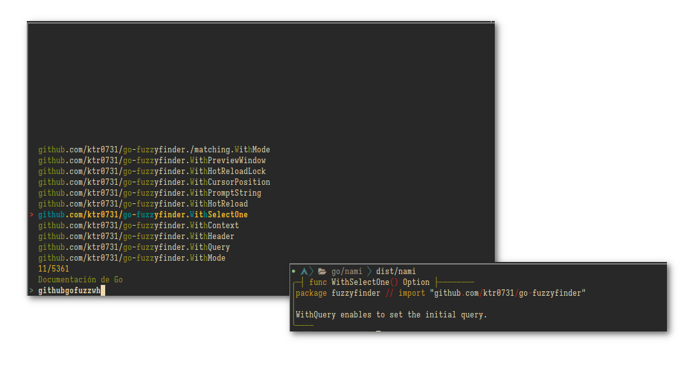

# Nami - Consulta de documentación de Go vía CLI

El comando `go doc` es una herramienta que muestra el contenido de la documentación de un paquete de Go. Por ejemplo, si deseas
mostrar la documentación de la biblioteca `fmt`, puedes usar el comando `go doc fmt`.

**`Nami`** es una herramienta CLI que complementa la parte de la búsqueda de documentación asociada al proyecto Go. Su
ffuncionamiento es buscar las funciones, métodos y tipos de las librerías asociadas al proyecto descritas en el archivo
`go.mod`.



El comando a ejecutar es sencillo:

```bash
$ nami
```

La aplicación revisa las respectivas librerías de la aplicación descritas en el archivo `go.mod` (por el momento solo las
librerias que no esten marcadas con el comentario `// indirect`) y las muestra en una interfaz sencilla para que el usuario
pueda elegir la función/método/tipo que desea ver la documentación a traves de la llamada a `go doc`.

> **Nota**: La aplicación muestra el contenido tanto de la documentación de la librería estandard como la de las librerías
> incluidas en el archivo `go.mod`. Todavía es un trabajo en proceso (WIP). Es usable para mejorar la busqueda de la
> documentación de Go, pero puede presentar algunos inconvenientes.
